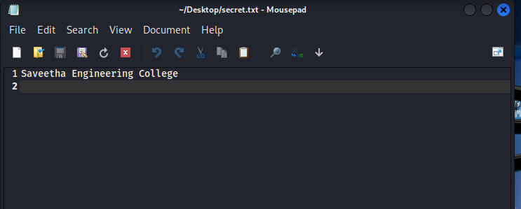
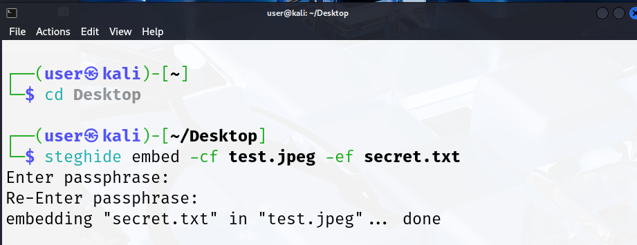
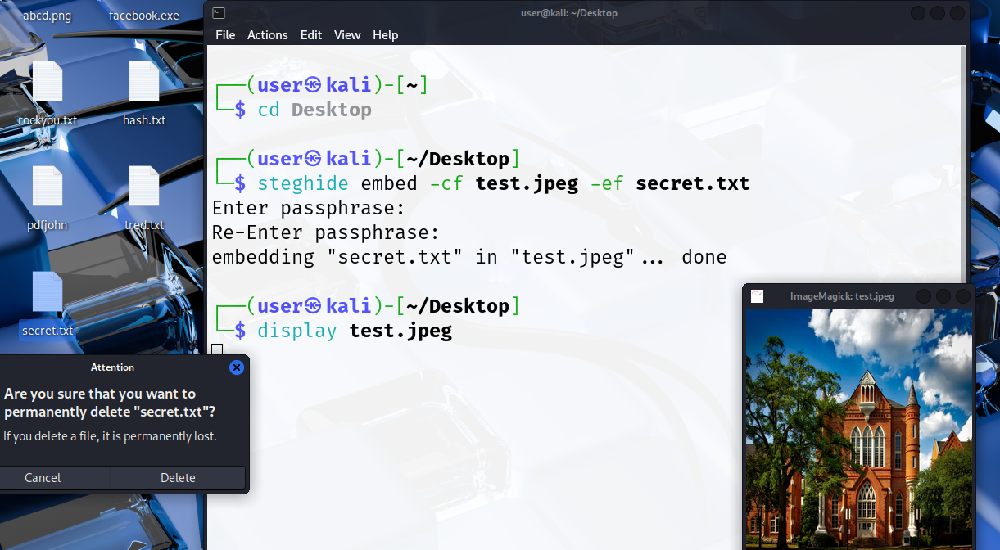
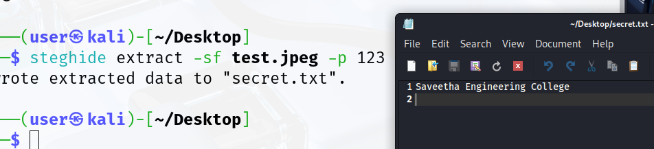
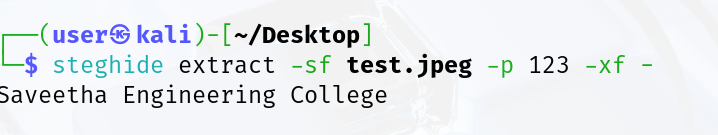
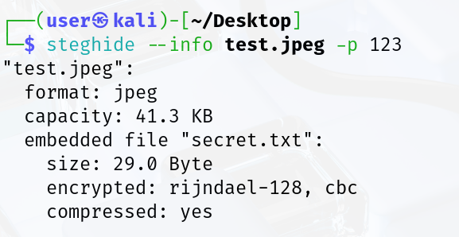

# Detecting-steganography-with-tools-like-StegExpose-analyzing-file-signatures
## AIM:
To detect hidden data using steganography detection tools like StegExpose and analyze file signatures for authenticity and manipulation.

## DESIGN STEPS:
### Step 1:
Install StegExpose or use the JAR version to detect steganography in image files.

### Step 2:
Run StegExpose on a directory of suspected image files using the command:

### Step 3:
Analyze file signatures using tools like file, binwalk, or xxd to check for inconsistencies or embedded content.

## PROCEDURE:
### Step 1: Download Image and Create Secret Message File
  •	Download a .jpeg image (e.g., praveen.jpeg) from a trusted website or use own image.
  
  

  •	Create a text file named secret with a confidential message:
  
  

### Step 2: Install and Verify Steghide Tool
  •	Install Steghide on Kali linux and confirm the installation by checking its version:
  
  
 
### Step 3: Embed the Secret Message into the Image
  •	Use the following command to embed secret into praveen.jpeg:

  

### Step 4: Delete the Original Secret File
  •	After embedding, delete the plaintext file:
  
  

## OUTPUT:
### Step 1: Extract the Embedded Secret from the Image
  •	To retrieve the hidden file:
  
  

  •	Enter the same passphrase used during embedding.
  
  

### Step 2: Verify the Extracted Message

  •	Display the extracted file content to verify:
  
  •	Ensure the message matches the original secret content.

  •	Another command to see the same secret message is
  
  

 
### Step 3: Retrieve Information About the Embedded Data
  •	To gather details about embedded content in the image:
  
    
  
  •	This will display file type, size, and whether data is embedded.

## RESULT:
Hidden data was successfully detected and file signatures were analyzed for irregularities.
